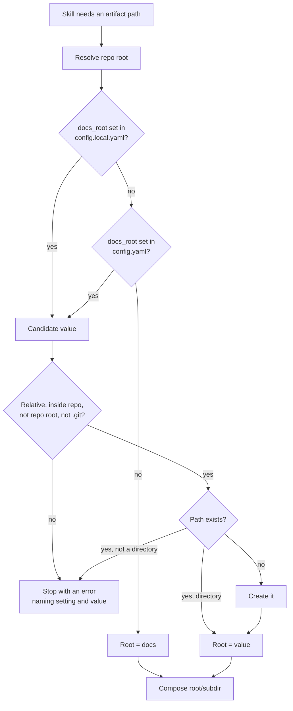
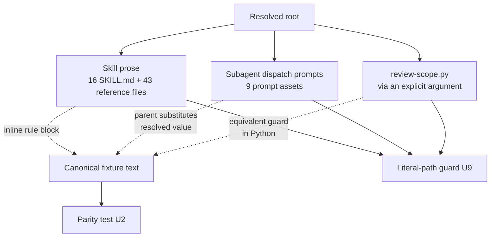

# Configurable Docs Root for CE Artifacts - Plan

## Goal Capsule

- **Objective:** Let a project relocate every Compound Engineering artifact folder to a repo-relative root of its choosing, so CE artifacts stop colliding with repos where `docs/` is tracked content owned by something else.
- **Product authority:** This plan owns the artifact *namespace* — where CE-written folders live inside the repo, and how every skill derives that location. It does not own artifact *persistence* across ephemeral workspaces; that is the `user_state_dir` half of `docs/plans/2026-03-25-002-refactor-config-storage-redesign-plan.md` and is not active scope here.
- **Authority hierarchy:** Product behavior is owned by the Requirements below. Implementation mechanism is owned by the Key Technical Decisions. A unit overrides neither.
- **Execution profile:** Mostly skill prose and prompt assets across 18 skill directories, plus one Python change. The deterministic guards (U2, U9) must land before or with the propagation units so drift is caught as it is introduced, not after.
- **Stop conditions:** Stop and surface if the R2 subdirectory enumeration turns out to be incomplete when re-derived against the tree, or if behavioral evaluation shows an agent resolving the root inconsistently across the two required harnesses.
- **Tail ownership:** Standalone run — `ce-work` owns branch, commits, and PR. Behavioral evaluation evidence (U11) belongs on the PR body, not in CI.
- **Open blockers:** None.

**Product Contract preservation:** restructured, no scope change. Two factual corrections from planning research: the "seven executable skill scripts" figure in Problem Frame and R10 is wrong — exactly one script resolves an artifact path at runtime. Answered Outstanding Questions were resolved in place into KTD1, KTD2, KTD5, KTD7, and KTD8 rather than left standing. No requirement was weakened, reclassified, or dropped; no R-ID changed.

KTD1 reverses the mechanism agreed during scoping — an extracted `references/` file — in favor of an inline block, because the repo's Skill Loading Supplements require load-bearing instructions to stay inline at the point where they fire. R18 already stated that constraint; the scoping proposal contradicted it.

---

## Product Contract

### Summary

Add one optional setting, `docs_root`, that names a repo-relative folder under which every CE-written artifact subdirectory lives. When it is unset, CE behaves exactly as it does today with everything under `docs/`. When it is set, that root becomes the sole location CE reads from and writes to.

### Problem Frame

CE skills resolve their artifact destinations from string literals: 288 occurrences of `docs/{solutions,plans,brainstorms,ideation,explainers,residual-review-findings,pulse-reports,dogfood-reports,feedback-sweep,personas}` across 18 skill directories, plus one executable script. Nothing consults configuration before resolving them.

That assumption breaks where `docs/` already belongs to something else. In a repo whose `docs/` tree is first-class tracked content on a different schema — an Obsidian vault, for instance — CE artifacts written into `docs/solutions/` mix into that content and ship via git to every derived clone. The collision runs in both directions: the vault's own notes sit in `docs/solutions/`, so CE's research subagents read foreign documents as if they were CE records.

The available workaround is a per-workspace symlink of each artifact directory into a store outside the repo, plus git-exclude entries. It has to be re-created for every new checkout, a skill invoked before the wiring silently writes real directories into the repo, and it cannot cover the vault case at all, because `docs/solutions/` there is real tracked content that cannot be replaced with a symlink. `ce-compound` is therefore unusable in that repo even though the other skills can be worked around.

Most projects will never set this. For the ones that need it, no amount of prompt-level instruction fixes it, because the paths are not derived — they are written down.

### Key Decisions

- KD1. **One `docs_root` key with fixed subdirectory names, not per-artifact-type overrides.** (session-settled: user-directed — chosen over per-type keys: the resolution rule must be restated across 18 skill directories and subagent dispatch prompts, so its brevity matters more than its flexibility.) Governs R1, R2.
- KD2. **The root is repo-relative and must resolve inside the repository.** (session-settled: user-directed — chosen over allowing absolute out-of-repo paths: an arbitrary configured write target turns every artifact write site into a path-safety surface.) Governs R3, R8.
- KD3. **A configured root is the sole namespace; CE never falls back to reading `docs/`.** (session-settled: user-directed — chosen over union-reading both locations: in the originating repo `docs/solutions/` holds foreign content, so a legacy read would feed it to CE's learnings scouts, and a permanent dual-read can never be deprecated.) Governs R6.
- KD4. **An unusable configured value stops the operation instead of falling back to `docs/`.** This is a deliberate exception to the plugin's standing config contract, which states that invalid values fall through to defaults (`skills/ce-setup/references/config-template.yaml`). Falling back writes CE artifacts into the location the operator configured away from, and reports success while doing it. Governs R8.
- KD5. **The setting is read from the tracked repo-config layer that `docs/plans/2026-03-25-002-refactor-config-storage-redesign-plan.md` reserves but does not implement.** That plan's layout marks `<repo_state_dir>/config.yaml` as "reserved / future" and only `config.local.yaml` shipped. `docs_root` is the first consumer that needs the reserved slot, because it is the only layer that reaches a fresh worktree. Governs R4, R5.
- KD6. **No migration of existing artifacts, automatic or assisted.** (session-settled: user-directed — chosen over an opt-in migration helper: CE cannot reliably distinguish its own files from foreign ones sharing a directory, so a helper would move the operator's real content in exactly the repo this feature exists to serve.) Governs R7.
- KD7. **This feature does not make artifacts survive an ephemeral workspace.** It addresses the collision case only. Cross-workspace durability requires storage outside the repo tree, which KD2 excludes and the March plan already owns.
- KD8. **The resolution rule is model-interpreted prose in 18 skills, so it is authored and evaluated as a skill change, not as a config change.** An agent reads the rule and derives a path from it; a deterministic test can prove the copies match but not that an agent follows them. Governs R17, R18, R21, R22.

### Requirements

**The setting**

- R1. A single optional setting named `docs_root` names the folder under which all CE-written artifact subdirectories live.
- R2. Subdirectory names beneath the root are fixed and unchanged: `solutions`, `plans`, `ideation`, `explainers`, `residual-review-findings`, `pulse-reports`, `dogfood-reports`, `feedback-sweep`, `personas`. A configured root of `X` yields `X/solutions`, `X/plans`, and so on.
- R3. The value is interpreted as a path relative to the repository root.
- R4. `docs_root` is readable from the tracked repo-level config file at `.compound-engineering/config.yaml`.
- R5. Reading the tracked layer is added without changing how existing settings resolve. No currently shipped setting changes its precedence or its file as a result of this work.

**Resolution behavior**

- R6. When `docs_root` is set, the resolved root is the only location CE reads artifacts from and writes artifacts to. CE performs no discovery reads against `docs/`.
- R7. When `docs_root` is unset in every consulted layer, every CE artifact path is byte-identical to today's behavior under `docs/`.
- R8. A set-but-unusable value stops the operation with an error naming the setting, the offending value, and why it was rejected. Unusable means: absolute, escaping the repository root (including via a symlink that resolves outside it), resolving to an existing non-directory, or not creatable. It does not mean merely absent.
- R9. A set, usable root that does not yet exist on disk is created before first write. A misspelled but structurally valid root is therefore not an error condition; it produces an unexpected directory rather than a leak into `docs/`.

**Propagation across consumers**

- R10. Every skill that resolves a CE artifact path derives it from `docs_root` rather than a literal. This covers agent-read skill prose, subagent prompt assets, and the one executable script that resolves an artifact path at runtime.
- R11. A skill that dispatches a subagent which reads or writes CE artifacts passes the already-resolved root into that subagent's prompt. Subagents do not re-resolve it.
- R12. The resolution rule is stated identically wherever it appears, and a deterministic test fails when any copy drifts from the others.
- R13. A deterministic test fails when a CE artifact path appears as a literal outside the resolution rule's own default clause.
- R14. `ce-doc-review`'s document classification keys on the resolved root's fixed subdirectory names rather than on literal `docs/` paths. The literal legacy paths remain valid classification input, as a named exception to R6 — classifying a document the operator supplied never ingests foreign content, unlike a discovery read.

**Operator-facing surface**

- R15. `/ce-setup` reports the resolved root and which layer supplied it.
- R16. The configuration reference documents `docs_root`, its default, its repo-relative constraint, and its departure from the standing invalid-values-fall-through rule.

**Skill authoring and evaluation**

- R17. Every line of skill prose added for this rule states a falsifiable constraint or counters a known default tendency, per the repo's Skill Prose Admission Rules and `docs/solutions/skill-design/portable-agent-skill-authoring.md`. Motivational rationale, vague effort language, and restatement of a rule that already stands on its own are not added.
- R18. The rule appears inline at the point where path resolution must fire in each skill, not as a summary ahead of it. It is extracted to a skill-local `references/` file only where it is conditional or late-sequence and a meaningful share of that skill.
- R19. Executed-shell and script call sites receive the resolved root as an explicit input rather than re-deriving it, and follow the repo's platform-variable tiers for how bundled scripts are invoked.
- R20. The change updates every documentation surface a config option owns in the same commit: the config template, its byte-identical example copy, the centralized configuration reference, and the affected consumer skill docs.
- R21. Prose behavior is evaluated in fresh context through the `skill-creator` eval workflow, because plugin skill definitions cache at session start and invoking the edited skill in the authoring session tests stale content.
- R22. Evaluation runs on at least Claude Code and Codex before merge, and its evidence is recorded on the pull request rather than added as a CI job. The deterministic guards in R12 and R13 are the CI half of this split.

### Acceptance Examples

- AE1. **Covers R7.** Given a repo with no `docs_root` set anywhere, when any CE skill writes an artifact, then it lands at the same path it would have before this change.
- AE2. **Covers R2, R3, R6.** Given `docs_root: .ce-artifacts`, when `ce-compound` writes a learning and later globs for existing learnings, then it writes to and reads from `.ce-artifacts/solutions/` only, and never reads `docs/solutions/`.
- AE3. **Covers R8.** Given `docs_root: ../shared-docs`, when any CE skill attempts to resolve an artifact path, then it stops with an error identifying the escaping value, and writes nothing to `docs/`.
- AE4. **Covers R9.** Given `docs_root: .ce-artfacts` (misspelled) and no such directory, when a CE skill writes an artifact, then the directory is created and the artifact lands inside it.
- AE5. **Covers R6, R11.** Given a configured root and a skill that dispatches a learnings-researcher subagent, when that subagent searches for prior learnings, then it searches only under the configured root.
- AE6. **Covers R6, R14.** Given a configured root and an operator who passes `ce-doc-review` a document at the legacy path `docs/brainstorms/old-thing.md`, then the document is classified as requirements without any discovery read of `docs/`.

### Success Criteria

- The evaluation demonstrates AE1, AE2, AE3, and AE5 on each evaluated harness. Those four are where an agent must interpret the rule rather than follow a script, so they are the coverage floor rather than the whole matrix.
- Added prose does not degrade the host skill's existing behavior. A skill that gains the rule still performs its own job at the quality it did before.
- A freshly dispatched subagent resolves the correct root from its dispatch prompt alone, without asking a clarifying question.

### Scope Boundaries

**Deferred for later**

- Cross-workspace artifact durability. Artifacts still live and die with the checkout. `docs/plans/2026-03-25-002-refactor-config-storage-redesign-plan.md` R17 owns the out-of-repo `user_state_dir` mechanism, and its worktree slugging is still an open item there.
- Per-artifact-type overrides. One root moves everything; a project that needs `solutions` and `plans` in different places is not served by this plan.
- The global config layer of the March plan's three-layer cascade. This work implements what `docs_root` needs and no more.

**Outside this feature**

- `docs/brainstorms/` as a write target. It is already legacy — new brainstorms write to `docs/plans/` — so it is read-and-classify only.
- `docs/specs/` and any other `docs/` subdirectory CE does not author.
- Migration or relocation of existing artifacts, per KD6.
- Any environment-variable configuration channel. Configuration stays YAML.

### Dependencies / Assumptions

- The tracked `.compound-engineering/config.yaml` path is not gitignored today. `.gitignore` ignores `.compound-engineering/*.local.yaml` only, so adding a tracked file at that path requires no gitignore change.
- Nothing currently reads a `.compound-engineering/config.yaml`, a global CE config, `repo_state_dir`, or `user_state_dir`. The layer this plan consumes must be built, not merely consumed.
- Skill directories cannot share files at runtime, and `src/` is the converter CLI rather than a runtime library skills can import. Any shared rule is duplicated per consumer and held together by a parity test; six such tests already exist under `tests/`.
- Assumed: the fixed subdirectory names in R2 are the complete set of CE-written artifact types. U1 re-derives the list against the tree rather than trusting this enumeration.
- `skills/ce-setup/references/config-template.yaml` and `.compound-engineering/config.local.example.yaml` are byte-identical today, so R20 requires updating both together.
- Plugin skill definitions cache at session start, so an eval that invokes the edited skill from the authoring session reads pre-edit content. R21 depends on this being avoided, not merely noticed.

### Outstanding Questions

**Deferred to Planning**

- Which additional harnesses beyond the R22 floor are worth evaluating, and whether any of them changes how the rule must be worded. Resolve after U11's first pass produces evidence on the two required harnesses.

### Sources / Research

- `docs/brainstorms/2026-03-25-config-storage-redesign-requirements.md` — R1 and R2 specify `config.yaml` plus `config.local.yaml` under `repo_state_dir` with `local > project > global` precedence; R17 places durable storage outside the repo under `user_state_dir`; line 164 records worktree slugging as unresolved.
- `docs/plans/2026-03-25-002-refactor-config-storage-redesign-plan.md` — status `active`; its layout block marks the tracked repo-level `config.yaml` as reserved and future.
- `docs/skills/configuration.md` — documents the shipped configuration surface, which is `config.local.yaml` only; line 16 states linked worktrees do not inherit it.
- `skills/ce-setup/references/config-template.yaml` — states the standing contract that invalid values fall through to defaults, which KD4 departs from.
- `skills/ce-code-review/scripts/review-scope.py` lines 76 and 139 — `Path("docs/solutions").is_dir()`, the only runtime artifact-path resolution in any skill script.
- `skills/ce-doc-review/SKILL.md` line 75 — the path-based classification tie-breaker that R14 addresses.
- `skills/ce-ideate/references/post-ideation-workflow.md` lines 54-56 — existing precedent for a conditionally resolved artifact destination.
- `tests/settled-decisions-parity.test.ts` — the shared-asset parity template U2 follows: byte-identity across a consumer list, plus a semantic pin so all copies cannot drift together.
- `docs/solutions/skill-design/pass-paths-not-content-to-subagents.md` — the recorded decision R11 follows.
- `AGENTS.md`, "File References in Skills" — the self-containment constraint that forces duplication over sharing. "Skill Loading Supplements" governs KTD1's inline-versus-extract choice. "Platform-Specific Variables in Skills" defines the tiers R19 follows; "Validating Agent and Skill Changes" and the "CI and Quality Gates" table define the CI-versus-eval split R22 follows.
- `docs/solutions/skill-design/portable-agent-skill-authoring.md`, "Evaluate proportionally" — mechanical checks belong in CI, behavioral evals are targeted local evidence; prioritizes weakest realistic layer, strong-model regression, restraint, fresh downstream consumer, and activation. It also warns that harnesses cache skill content at session start.
- GitHub issue #1228 — the originating report and its two situations.

---

## Planning Contract

### Key Technical Decisions

- KTD1. **The rule ships as an inline delimited block in each consuming skill, with its canonical text held as a test fixture — not as an extracted `references/` file.** The repo's Skill Loading Supplements require load-bearing instructions to stay inline at the point where they must fire, and reserve `references/` extraction for blocks that are conditional or late-sequence and a meaningful share of the skill. A five-line always-fires rule is neither. Extraction would also add a load step to every path resolution. The parity guard works the same either way: the canonical text lives once under `tests/fixtures/`, and U2's test asserts each consumer contains it verbatim. Covers R12, R18.
- KTD9. **How the block reaches path-resolving reference files is decided per skill by U1's resolver-count pass, not fixed now.** A reference file that composes an artifact path independently of its SKILL.md needs the block or a threaded resolved value; one that merely mentions a path does not. The two viable shapes — full block in each independently-resolving reference (parity surface grows, no load-order assumption) versus resolve-once-in-SKILL.md-and-thread-the-value (parity stays small, requires threading one value through) — trade parity surface against authoring change per skill. U1 counts the true independent resolvers per skill and picks the cheaper correct shape for that skill, recording the count so the choice is evidence-based. Covers R12, R18.
- KTD2. **Precedence is `config.local.yaml` > `config.yaml`, first-found-wins per key, and the tracked layer is added as a general layer rather than a `docs_root`-only read path.** This matches the cascade the March requirements already specify (`local > project > global`), so the next setting to need it inherits working machinery instead of a second model. The global layer stays out per Scope Boundaries. Setting `docs_root` in the gitignored local layer is permitted but documented as a per-checkout divergence that splits one project's artifacts across two locations. Covers R4, R5.
- KTD3. **Validation is duplicated, not shared, because skills have no runtime library.** Prose consumers get the rule's validation clauses; `review-scope.py` gets an equivalent guard in Python. `src/utils/` is converter-CLI code that never executes during a skill run and must not be treated as a shared home for this. Covers R8, R19.
- KTD4. **Containment is checked against the real (symlink-resolved) path, and rejects the repository root itself and any path inside `.git/`.** A relative value can still escape the repo through a symlink, so containment resolves symlinks before comparing — the same `-L` caution these skills already apply when creating their scratch root. Resolving to the repo root would make every CE artifact a top-level sibling of the project's own tree, and `.git/` is never a legitimate artifact destination. All three are cheap to state in the rule and expensive to discover by accident. Covers R8.
- KTD5. **`ce-doc-review` classifies on the final path segment (`plans`, `brainstorms`, `ideation`), not on a full path prefix.** One rule then covers a configured root, the default root, and the legacy location without a discovery read or a second code path. Covers R14.
- KTD6. **The literal-path guard is a new test file, not an extension of an existing one.** It needs its own allowlist — the rule block's default clause, and bibliographic citations to learning documents inside comments — and folding that allowlist into an unrelated suite would obscure both. Covers R13.
- KTD7. **`docs_root` is documented in the existing config template and its byte-identical example copy, annotated as belonging in the tracked file.** A second committed example file would double the parity surface for one key. Covers R16, R20.
- KTD8. **Behavioral evaluation uses a representative fixture set — one skill per read shape plus the script consumer — rather than all 18 skills on both harnesses.** The field guide's "Evaluate proportionally" explicitly warns against implying a full model-by-harness matrix per edit; the three read shapes are where interpretation actually varies. Covers R21, R22.

### High-Level Technical Design

*Directional guidance for review, not implementation specification.*

Resolution runs once per skill invocation, before any artifact path is used:

The resolved root reaches three consumer classes, each by a different mechanism:

### Assumptions

None carried forward — the scoping synthesis was confirmed interactively and every inferred bet either became a KTD above or was corrected during that exchange.

### Sequencing

Phase A (U1, U2) establishes the mechanism and its guard. Phase B (U3–U8) propagates it; those units are independent of each other and can land in any order once Phase A is in. Phase C (U9, U10) adds the repo-wide guard and the documentation surfaces, and U9 will fail until Phase B is complete — that is intended, it is the completeness check. Phase D (U11) runs last because it evaluates the finished prose.

### Risks and Dependencies

- **A missed substitution site is the most likely defect.** 288 literals across roughly 60 files is past the size where review catches everything by eye, and a missed site fails silently by writing to the default location. U9 is the mitigation and is the reason it scans repo-wide rather than per-unit; it must land before the PR, not after.
- **Adding a block to 18 skills can degrade the skills themselves.** The field guide's strong-model-regression concern applies directly: prose added to a skill competes for attention with that skill's own instructions. U11's regression scenario is the check, and the Skill Prose Admission Rules in R17 are the preventive constraint — if the block cannot be written to that standard, the design is wrong, not the standard.
- **The tracked config layer becomes shared machinery on first use.** Once `docs_root` reads it, the next setting to want a repo-level default inherits whatever precedence and validation this work establishes. KTD2 chooses the March cascade's ordering for that reason; a narrower one-key read path would have deferred the cost rather than removed it.
- **Depends on `docs/plans/2026-03-25-002-refactor-config-storage-redesign-plan.md` remaining unexecuted in this area.** That plan is `status: active` and reserves the same slot. If it starts building `repo_state_dir` resolution independently, the two must be reconciled before both land.
- **The riffrec analyzer keeps writing under the legacy brainstorms path.** A project that configures a root still gets that one writer landing in the default location. Accepted for this plan because the legacy path is out of scope, but it means "no CE writes outside the configured root" is not yet literally true.

---

## Implementation Units

| U-ID | Title | Files touched | Depends on |
|---|---|---|---|
| U1 | Resolution semantics and the tracked config layer | `skills/ce-setup/` | — |
| U2 | Canonical rule text, fixture, and parity test | `tests/fixtures/`, `tests/` | U1 |
| U3 | Propagate to write-path skills | `skills/ce-{plan,brainstorm,ideate,compound,compound-refresh}/` | U2 |
| U4 | Propagate to read and discovery skills | `skills/ce-{work,code-review,pov,optimize,explain,debug}/`, `skills/lfg/` | U2 |
| U5 | Propagate to remaining artifact owners | `skills/ce-{sweep,dogfood,product-pulse,commit-push-pr,setup,proof}/` | U2 |
| U6 | Subagent prompt assets | 9 files under `skills/*/references/{agents,personas}/` | U2 |
| U7 | Resolved-root argument for the review-scope script | `skills/ce-code-review/scripts/review-scope.py` | U1 |
| U8 | Classification by final path segment | `skills/ce-doc-review/SKILL.md` | U2 |
| U9 | Literal-path guard | `tests/` | U3–U8 |
| U10 | Documentation surfaces | `skills/ce-setup/references/`, `.compound-engineering/`, `docs/skills/` | U1 |
| U11 | Cross-harness behavioral evaluation | none (evidence on the PR) | U3–U8 |

### Phase A — Resolution mechanism

### U1. Resolution semantics, canonical rule text, and the tracked config layer

- **Goal:** Define how `docs_root` resolves, author the canonical rule block that every consumer will carry, make the tracked `.compound-engineering/config.yaml` layer readable, and have `/ce-setup` report the resolved root and its source layer.
- **Requirements:** R1, R2, R3, R4, R5, R7, R8, R9, R15, R17, R18. Governed by KD1, KD2, KD4, KD5, KD8, KTD1, KTD2, KTD4.
- **Dependencies:** none.
- **Files:** `skills/ce-setup/SKILL.md`, `skills/ce-setup/scripts/check-health`.
- **Approach:**
  1. Re-derive the R2 subdirectory list against the current tree; stop and surface if it differs from the enumeration in R2 rather than silently widening it.
  2. Extend the existing config-read prose so the tracked layer is consulted after the local one, first-found-wins per key, without altering how any shipped setting resolves (R5).
  3. Specify the validation and creation branches exactly as the resolution flowchart above shows, including KTD4's symlink-resolved containment and its repo-root and `.git/` rejections.
  4. Author the canonical rule block here — the five-line statement of derive-root, validate, create-if-missing, fail-closed, compose-subdir — held to the Skill Prose Admission Rules. `ce-setup` is its home because `ce-setup` owns resolution; U2 lifts this exact text into the fixture rather than inventing it, so the semantics have one authoring owner.
  5. Run the resolver-count pass (KTD9): for each consuming skill, count the reference files that compose an artifact path *independently* of their SKILL.md, versus those that only mention one. Record the per-skill counts. Where a skill has few or no independent resolvers, its references cite the resolved root and only SKILL.md carries the block; where it has many, SKILL.md resolves once into a named value that references consume. This decision feeds U3–U5's file lists.
  6. Add the resolved root and its source layer to the `/ce-setup` health output.
- **Patterns to follow:** the existing config-read sentence in `skills/ce-brainstorm/SKILL.md` Phase 0.0 ("resolve `<repo-root>` at runtime … read … fall through on missing or invalid") is the shape to extend, not replace.
- **Test scenarios:**
  - Covers AE1. No `docs_root` in either layer resolves to `docs`.
  - `docs_root` present only in the tracked layer resolves to that value.
  - `docs_root` present in both layers resolves to the local layer's value.
  - Covers AE3. An absolute value, a `../` escape, a value resolving to the repo root, and a value resolving inside `.git/` each stop with an error naming the setting and the value.
  - A value pointing at an existing regular file stops with an error rather than being created.
  - Covers AE4. A structurally valid value with no directory on disk is created.
  - `/ce-setup` health output names the resolved root and which layer supplied it, in both the configured and unconfigured cases.
- **Verification:** `bun run test` passes, and `/ce-setup` reports the correct root under each of the three layer configurations.

### U2. Canonical rule text, fixture, and parity test

- **Goal:** Author the rule text once, store it as a fixture, and add the test that fails when any consumer's inline copy drifts.
- **Requirements:** R12, R17, R18. Governed by KD8, KTD1.
- **Dependencies:** U1 (the semantics the text states).
- **Files:** `tests/fixtures/docs-root-rule.md`, `tests/docs-root-rule-parity.test.ts`.
- **Approach:**
  1. Lift the canonical block authored in U1 (`skills/ce-setup/SKILL.md`) into the fixture verbatim. U2 does not re-author the rule — U1 owns the wording; U2 canonicalizes it for the parity check.
  2. Store it as a fixture rather than a skill-local reference, per KTD1 — it is parity source material, not runtime content, and storing it under `references/` would invite a load step the rule must not need.
  3. Write the parity test on the `tests/settled-decisions-parity.test.ts` template: assert each consumer file contains the fixture text verbatim, plus a semantic pin so every copy cannot drift together.
- **Patterns to follow:** `tests/settled-decisions-parity.test.ts` — the consumer list as a named constant, and the byte-identity assertion paired with a token pin.
- **Test scenarios:**
  - A consumer whose inline block differs by one character fails the parity assertion.
  - A consumer missing the block entirely fails with a message naming that consumer.
  - The semantic pin fails if the fixture loses the default-clause token or the fail-closed token.
  - Adding a new consumer to the list without adding the block fails.
- **Verification:** the parity test fails when a copy is edited by hand and passes when it is restored.

### Phase B — Propagation

### U3. Propagate to write-path skills

- **Goal:** Replace hardcoded artifact paths with the resolved root in the five skills that author artifacts.
- **Requirements:** R6, R10, R17, R18. Governed by KTD1.
- **Dependencies:** U2.
- **Files:** `skills/ce-plan/SKILL.md` and `skills/ce-plan/references/`, `skills/ce-brainstorm/SKILL.md` and `skills/ce-brainstorm/references/`, `skills/ce-ideate/`, `skills/ce-compound/`, `skills/ce-compound-refresh/`.
- **Approach:** Insert the rule block inline where each skill first resolves an artifact path, then rewrite every literal in that skill's prose and references to compose from the resolved root. `ce-ideate`'s existing existence-conditional destination becomes a consumer of the resolved root rather than a second resolution mechanism.
- **Execution note:** land the parity test from U2 first, then let it fail while these copies are added — the failure is the checklist.
- **Patterns to follow:** `skills/ce-ideate/references/post-ideation-workflow.md` lines 54-56, the existing conditional-destination precedent.
- **Test scenarios:**
  - Parity passes for all five once the block is in place.
  - No literal artifact path remains in these skills outside the rule's default clause.
  - Covers AE2. `ce-compound`'s fresh-glob step composes from the resolved root and performs no read against the default location when a root is configured.
- **Verification:** `bun run test` passes; the U9 guard reports zero residual literals in these five directories.

### U4. Propagate to read and discovery skills

- **Goal:** Same substitution for the skills whose primary interaction is discovery globbing and prior-work scanning.
- **Requirements:** R6, R10, R17, R18.
- **Dependencies:** U2.
- **Files:** `skills/ce-work/SKILL.md`, `skills/ce-code-review/`, `skills/ce-pov/`, `skills/ce-optimize/`, `skills/ce-explain/`, `skills/ce-debug/SKILL.md`, `skills/lfg/`.
- **Approach:** Insert the rule block, then rewrite each discovery glob to compose from the resolved root. `ce-work`'s blank-invocation plan discovery and `ce-code-review`'s keyword plan matching are the two highest-traffic globs and should be reviewed by hand after substitution.
- **Test scenarios:**
  - Parity passes across all seven.
  - `ce-work` blank-invocation discovery globs the configured root and not the default.
  - `ce-code-review` keyword plan matching globs the configured root.
  - `ce-pov`'s mandatory prior-decision scan targets the configured root.
- **Verification:** `bun run test` passes; U9 reports zero residual literals in these directories.

### U5. Propagate to remaining artifact owners

- **Goal:** Same substitution for the skills owning the lower-traffic artifact types.
- **Requirements:** R6, R10, R17, R18.
- **Dependencies:** U2.
- **Files:** `skills/ce-sweep/`, `skills/ce-dogfood/`, `skills/ce-product-pulse/`, `skills/ce-commit-push-pr/`, `skills/ce-setup/`, `skills/ce-proof/`.
- **Approach:** Insert the rule block and substitute literals. Leave `analyze_riffrec_zip.py`'s `docs/brainstorms/` default alone — that path is out of scope per Scope Boundaries, and it is byte-parity-guarded across two skills by `tests/ce-sweep-analyzer-parity.test.ts`.
- **Test scenarios:**
  - Parity passes across all six.
  - `ce-commit-push-pr`'s explainer archive writes under the configured root.
  - `ce-sweep`'s feedback-sweep state path composes from the configured root.
  - The riffrec analyzer's default is unchanged and its existing parity test still passes.
- **Verification:** `bun run test` passes; U9 reports zero residual literals in these directories apart from the allowlisted riffrec default.

### U6. Subagent prompt assets

- **Goal:** Make the nine dispatch prompt assets receive the resolved root instead of naming a literal.
- **Requirements:** R6, R10, R11. Governed by KD3.
- **Dependencies:** U2.
- **Files:** `skills/ce-explain/references/agents/work-recap-scout.md`, `skills/ce-ideate/references/agents/learnings-researcher.md`, `skills/ce-optimize/references/agents/learnings-researcher.md`, `skills/ce-plan/references/agents/learnings-researcher.md`, `skills/ce-plan/references/agents/git-history-analyzer.md`, `skills/ce-pov/references/agents/precedent-activity-scout.md`, `skills/ce-pov/references/agents/project-grounding-scout.md`, `skills/ce-code-review/references/personas/project-standards-reviewer.md`, `skills/ce-code-review/references/personas/learnings-researcher.md`.
- **Approach:** Replace the literal in each asset with a placeholder the dispatching skill fills at dispatch time, and add the substitution instruction to each calling skill's dispatch step. The parent resolves once; the subagent never resolves. This follows the recorded pass-paths-not-content decision — the parent passes a resolved path, not the config file.
- **Test scenarios:**
  - Covers AE5. A dispatched learnings researcher receives the configured root and searches only under it.
  - No prompt asset contains a literal artifact path after substitution.
  - A dispatch step that forgets the substitution leaves an unfilled placeholder, which the U9 guard catches.
- **Verification:** `bun run test` passes; U9 reports zero residual literals and zero unfilled placeholders across the nine assets.

### U7. Resolved-root argument for the review-scope script

- **Goal:** Make the one script that resolves an artifact path at runtime take the root as an explicit input.
- **Requirements:** R8, R10, R19. Governed by KTD3.
- **Dependencies:** U1.
- **Files:** `skills/ce-code-review/scripts/review-scope.py`, `skills/ce-code-review/SKILL.md`.
- **Approach:** Add a `--docs-root` argument alongside the existing `--base`/`--head`, defaulting to `docs`, and replace both `Path("docs/solutions").is_dir()` sites with a composition from it. Add the containment guard in Python per KTD3 — it cannot be shared from prose or from `src/`. Update the skill's invocation of the script to pass the already-resolved root, per the repo's platform-variable tiers for executed shell.
- **Test scenarios:**
  - Omitting `--docs-root` reproduces today's behavior exactly.
  - Passing a configured root makes the learnings-corpus check target that root.
  - Passing an absolute value, a `../` escape, or a path inside `.git/` exits non-zero with an error naming the argument.
  - Passing a path that exists as a regular file exits non-zero.
- **Verification:** `bun run test` passes, including the script's own test coverage.

### U8. Classification by final path segment

- **Goal:** Make document classification independent of where the root lives, while keeping the legacy paths classifiable.
- **Requirements:** R14. Governed by KTD5.
- **Dependencies:** U2.
- **Files:** `skills/ce-doc-review/SKILL.md`.
- **Approach:** Rewrite the tie-breaker to key on the final path segment rather than a full literal prefix, so the configured root, the default root, and the legacy location all classify through one rule. State in the prose that this is a named exception to the no-legacy-reads rule and why — classification of an operator-supplied file is not a discovery read.
- **Test scenarios:**
  - Covers AE6. A document at the legacy brainstorms path classifies as requirements with no discovery read of the default location.
  - A document under a configured root's plans directory classifies as a plan.
  - A document under the default plans directory classifies as a plan.
  - A document whose path carries no recognized segment falls through to content-based classification unchanged.
- **Verification:** `bun run test` passes; classification behavior is unchanged for all three path shapes.

### Phase C — Surface and guards

### U9. Literal-path guard

- **Goal:** Fail the build when a CE artifact path appears as a literal anywhere it should now be derived.
- **Requirements:** R13. Governed by KTD6.
- **Dependencies:** U3, U4, U5, U6, U7, U8.
- **Files:** `tests/docs-root-literals.test.ts`.
- **Approach:** Scan skill content for the R2 subdirectory names preceded by the default root. Allowlist exactly two categories, distinguished by position: the rule block's own default clause (matched by its surrounding fixture text, not a bare path), and bibliographic citations that sit inside a comment line — a `#` or `//` comment in a script, or a Markdown reference-style citation — pointing at a specific `.md` learning document. A functional literal is any occurrence not inside a comment and not part of the rule block; that is what fails. The two `elevation-dispatch.sh` header comments are the known citation instances, and rewriting a citation to a document's past location would be wrong. Also fail on an unfilled dispatch placeholder, so U6's substitution gap is caught by the same guard.
- **Test scenarios:**
  - A newly added literal in any skill fails the guard, with a message naming file and line.
  - The rule block's default clause does not fail it.
  - A bibliographic citation in a comment does not fail it.
  - An unfilled placeholder in a prompt asset fails it.
  - The guard passes against the tree once Phase B is complete.
- **Verification:** `bun run test` passes; introducing a literal by hand fails the guard and removing it restores green.

### U10. Documentation surfaces

- **Goal:** Document `docs_root` everywhere a config option is owned, in one change.
- **Requirements:** R16, R20. Governed by KTD7.
- **Dependencies:** U1.
- **Files:** `skills/ce-setup/references/config-template.yaml`, `.compound-engineering/config.local.example.yaml`, `docs/skills/configuration.md`, `docs/skills/ce-setup.md`.
- **Approach:** Add the commented `docs_root` example to the template and its byte-identical copy, annotated as belonging in the tracked file. Add a row to `docs/skills/configuration.md`'s options table, and state the fail-closed exception there explicitly — the same file currently asserts the opposite as a blanket rule ("invalid values fall through to defaults"), and leaving that unqualified would make the exception look like a bug. Update `docs/skills/ce-setup.md` to mention the resolved-root reporting added in U1. No other skill page references artifact-root resolution today, so those two are the surface.
- **Test scenarios:**
  - The template and its example copy remain byte-identical, asserted by the existing check-health coverage.
  - Editing one of the two without the other fails that check.
  - The configuration reference names `docs_root`, its default, its repo-relative constraint, and the fail-closed exception.
- **Verification:** `bun run test` and `bun run release:validate` pass; the template and its example copy diff clean.

### Phase D — Evaluation

### U11. Cross-harness behavioral evaluation

- **Goal:** Produce evidence that an agent actually follows the rule, on both required harnesses.
- **Requirements:** R21, R22, and the Success Criteria. Governed by KD8, KTD8.
- **Dependencies:** U3, U4, U5, U6, U7, U8.
- **Execution mode:** Human-in-the-loop and terminal — this unit is not autonomously executable. A `ce-work` or `/goal` run should stop at U11 and hand back, because the `skill-creator` eval workflow needs a driver to launch runs on each harness and read the outcomes. It is the last unit for that reason.
- **Files:** none in the repo — evidence is recorded on the pull request.
- **Approach:** Use the `skill-creator` eval workflow so each run reads current source from disk rather than the session's cached skill definitions. Evaluate a representative fixture set per KTD8: one write-path skill, one discovery skill, one subagent-dispatching skill, and the script consumer. Run each on Claude Code and Codex. Record per-harness outcomes on the PR body.
- **Execution note:** do not evaluate by invoking the edited skills in the authoring session — plugin definitions cache at session start and that path tests pre-edit content.
- **Test scenarios:**
  - Covers AE1. Unset root reproduces today's paths on both harnesses.
  - Covers AE2. Configured root is used for both write and discovery, with no read against the default location.
  - Covers AE3. An escaping value stops the run with an error rather than silently falling back.
  - Covers AE5. A dispatched subagent searches only the configured root.
  - Strong-model regression: each evaluated skill still performs its own job at prior quality with the block added.
  - Restraint: no evaluated skill invents a migration step, a per-type override, or a legacy read.
- **Verification:** every scenario above passes on both harnesses, or a failure is recorded with the prose change it drove.

---

## Verification Contract

| Gate | Command | Applies to | Done signal |
|---|---|---|---|
| Full suite | `bun run test` | U1–U10 | Green, including the new parity and literal guards |
| Plugin and marketplace consistency | `bun run release:validate` | U10 | Green |
| Schema validation | `bun run plugin:validate` | U3–U6, U8 | Green |
| Parity | `bun test tests/docs-root-rule-parity.test.ts` | U2–U6 | Every consumer contains the canonical block verbatim |
| Literal guard | `bun test tests/docs-root-literals.test.ts` | U9 | Zero residual literals outside the allowlist |
| Behavioral evaluation | `skill-creator` eval workflow | U11 | Success Criteria met on Claude Code and Codex, evidence on the PR |

Behavioral evaluation is not a CI job and must not be added as one. It is best-effort local evidence per the repo's CI-versus-eval split.

---

## Definition of Done

**Global**

- Every requirement R1–R22 is satisfied or explicitly deferred in the artifact.
- With no `docs_root` configured anywhere, every CE artifact path is byte-identical to pre-change behavior.
- With a root configured, no CE skill, prompt asset, or script reads or writes the default location, apart from the allowlisted riffrec default and the classification exception.
- All Verification Contract gates pass.
- Behavioral evaluation evidence for both required harnesses is on the PR body.
- No dead-end or experimental code from abandoned approaches remains in the diff — in particular, no partially-migrated skill left with both a literal and a derived path.

**Per unit**

- U1: all three layer configurations resolve correctly; all five rejection cases stop with a named error.
- U2: parity test fails on a hand-edited copy and passes on restore.
- U3–U6, U8: parity passes, and the U9 guard reports zero residual literals in the unit's directories.
- U7: the script reproduces today's behavior without the new argument and honors it when passed.
- U9: guard fails on an introduced literal and on an unfilled placeholder.
- U10: template and example copy are byte-identical; the configuration reference carries the fail-closed exception.
- U11: every listed scenario passes on both harnesses, or its failure drove a recorded prose change.
